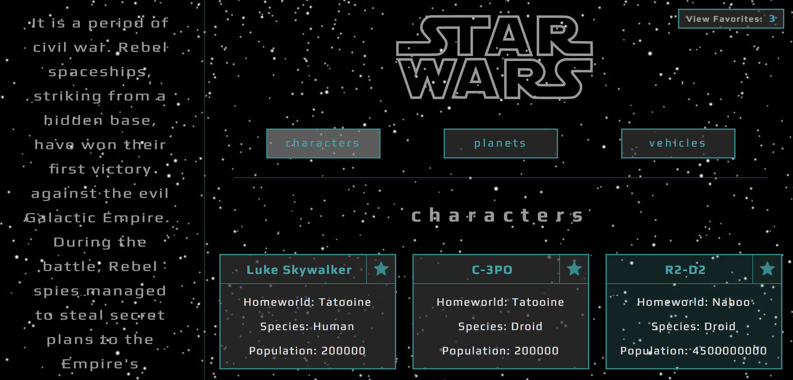
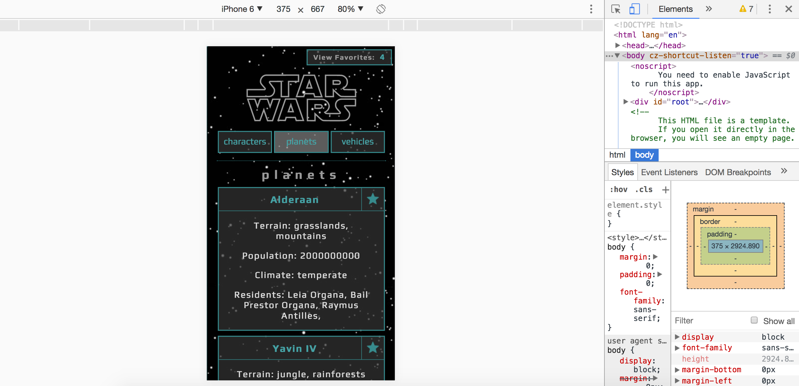

## Star Wars API (SWapi Box)

#### The aim of this project was to learn and practice:
* making asynchronous API calls, 
* apply Promise.all, 
* test asynchronous JavaScrip,
* impelement React Router 4,
* develop skills in writing more complex React code

Original assignment: [Turing Project](http://frontend.turing.io/projects/swapi-box.html)

#### Desktop layout:

#### Tablet:

#### Cell Phone:

