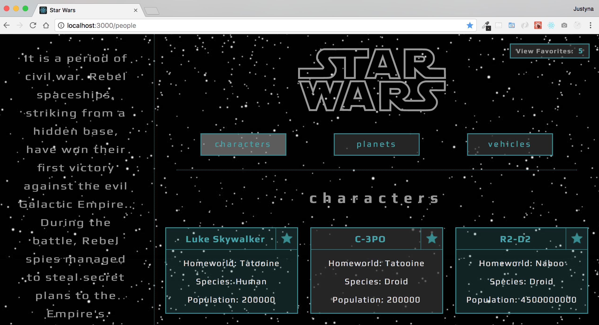

## Star Wars API (SWapi Box)

#### The aim of this project was to learn and practice:
* making asynchronous API calls, 
* apply Promise.all, 
* test asynchronous JavaScript,
* impelement React Router 4,
* develop skills in writing more complex React code.

### Original assignment: [Turing Project](http://frontend.turing.io/projects/swapi-box.html)


#### Desktop layout:


#### Tablet:


#### Cell Phone:


### Code Sample:
```
const callPlanets = (page, main) => {

  fetch(`http://swapi.co/api/${page}/`)
  .then(res => res.json())
  .then(data => {

    const residentsArr = data.results.map(planet => {
     const residents = planet.residents.map(call =>
      fetch(call)
      .then(resp => resp.json())
      .then(value => {
        return value.name})
      .catch(error => console.log('error fetching residents in planets:', error)))

      return Promise.all(residents)
      .then(values => {
        return Object.assign(planet, {residents: values})
       })
     })
    return Promise.all(residentsArr)
  })

  .then(value =>
    main.setState({planets: value})
  )
  .catch(error => console.log('error fetching planets:', error))
}
```
